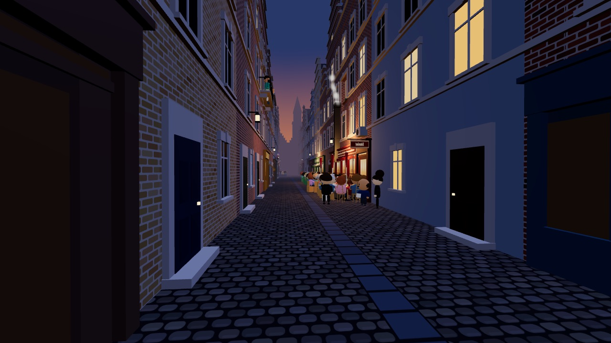
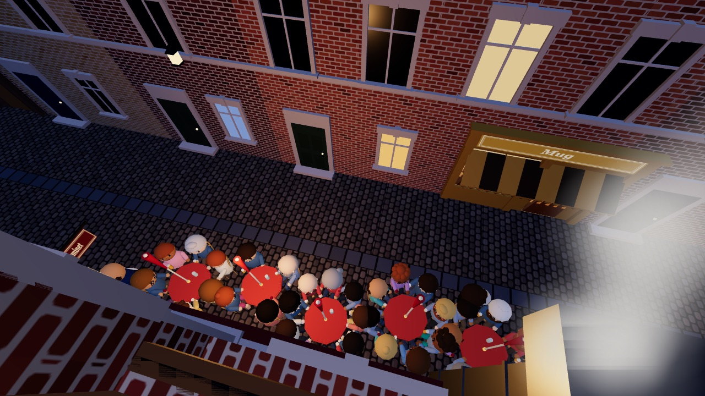
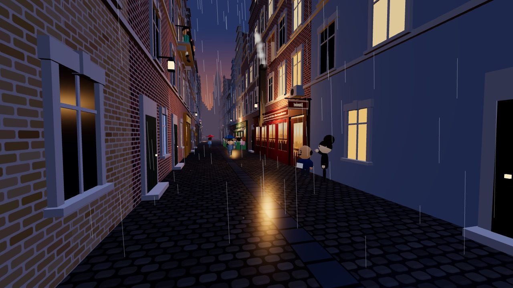
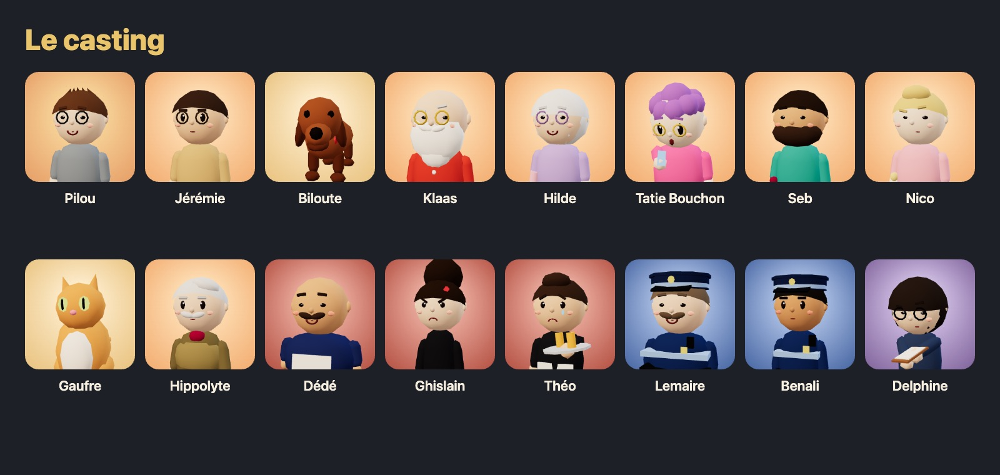

# Rue des Bouchers

**Quatorze jours pour dormir à nouveau.** Pilou habite au-dessus d'un estaminet du Vieux-Lille, la gaine d'extraction souffle
sous sa fenêtre et les terrasses ne rentrent jamais à 22h. Photos, décibels, voisins, police municipale, mairie… ou seau d'eau :
à vous de monter le dossier avant la commission des terrasses. Un jeu 3D de quartier, satirique et tendre, dans le navigateur.

> **Œuvre de fiction.** Le jeu se déroule dans une vraie rue de Lille, mais tous les personnages, commerces, policiers,
> élus et institutions représentés sont fictifs. Toute ressemblance avec des personnes ou des établissements existants
> serait fortuite. Aucune personne réelle n'est représentée ni mise en cause.

**▶ [Jouer](https://rue-des-bouchers.lucaslefort.dev)**

| | |
|---|---|
|  |  |
|  |  |

_Captures rendues par le jeu lui-même : `node scripts/capture-art.mjs http://localhost:5173` (serveur de dev lancé)._

## Comment jouer

**Le but.** Le jour 14, la mairie réunit la commission des terrasses. D'ici là, il faut un dossier assez solide pour faire
respecter les règles de la rue : fermeture à 22h tous les soirs (depuis 2026), six personnes au maximum par table, un couloir
de passage libre au milieu de la rue. Ou trouver d'autres moyens. Ils ont des conséquences.

**Une journée, trois temps.**
- **Le matin, chez Koddex** : trois prompts pour Clode Kode, l'assistant de code beaucoup trop poli. Du vrai travail (sinon
  Stéphane, le patron, finit par vous licencier) ou des projets perso pour l'association : un enregistreur de décibels, un bot
  WhatsApp, un scraper d'avis…
- **L'après-midi** : trois créneaux pour l'association, la mairie, la presse, l'avocat, les voisins.
- **La nuit, de 20h30 à environ 1h30** : la rue en 3D, à la première personne. Photographier, mesurer, appeler la police,
  parler au serveur. Les nuits ne se rattrapent pas : se coucher tôt, c'est rater ce qui se passe dehors.

**Les commandes, la nuit.**

| Touche | Action |
|---|---|
| ZQSD / WASD, Maj, souris | Se déplacer, courir, regarder |
| E | Portes, serveur, lit |
| P | Photo (preuve horodatée) |
| B | Relevé en décibels |
| T | Téléphone : police, groupe WhatsApp de l'association, mairie |
| N | Actions de nuit |
| Tab | Le dossier |
| L | Zones légales : le tracé des terrasses autorisées et du couloir |
| F | Le seau d'eau, depuis la fenêtre (illégal) |
| M | Couper le son |

Le jour : **C** ouvre le Carnet (les gens, les lieux, les règles), **❓** l'aide.

**Légal, gris, illégal.** Les actions sont classées par couleur. Le légal construit le dossier. Le gris rend service, mais peut
se savoir. L'illégal soulage, et fait monter le Risque dès que quelqu'un vous voit. Une preuve obtenue illégalement ne compte
pas devant la commission (la presse, elle, s'y intéresse).

**Les témoins.** Un acte que personne ne voit ne laisse pas de trace. Mais Klaas note tout depuis sa fenêtre sur la place (il dort
après 1h), Seb et Nico regardent tant que la chatte est au balcon, le serveur et les clients voient aussi, et certains filment.

**Huit fins.** Victoire juridique, paix négociée, scandale, garde à vue, déménagement à Wazemmes, licenciement… et deux autres à
découvrir. L'épilogue raconte ce que vous avez réellement fait. Une campagne dure environ trois heures.

La partie s'enregistre toute seule dans le navigateur.

## Lancer le jeu en local

Il faut Node.js 22 (la version de la CI).

```sh
npm install
npm run dev          # le jeu sur http://localhost:5173
npm test             # tests unitaires (simulation, campagne, contenu, typographie)
npm run sim          # simulateur de campagnes : 200 parties par stratégie, distribution des fins (options en tête de scripts/sim.js)
npm run story -- --bot legal --seed 3   # une campagne entière racontée en texte, jour par jour
npm run test:e2e     # tests de bout en bout dans Chromium (Playwright)
npm run build        # version de production dans dist/
```

Pour le débogage, `?nolock=1` désactive la capture de la souris, `?seed=N` rejoue la même soirée et `?day=sat` lance une nuit
libre un samedi.

## Organisation du projet

| Dossier | Contenu |
|---|---|
| `src/sim/` | La simulation, sans rendu : la nuit (police, témoins, bruit, preuves), la campagne de 14 jours, les sauvegardes, le linter de contenu, les bots du simulateur |
| `src/content/` | Tout le texte du jeu, en données pures : personnages, actions, événements, dialogues, contre-offensives du bloc, fins, Koddex, téléphone, Carnet. Bible de l'histoire : `src/content/README.md` |
| `src/ui/` | L'interface des journées : écran titre, Koddex, après-midi, cartes, téléphone, bilan de nuit, Carnet, écrans de fin |
| `src/art/` | Personnages, façades, accessoires et portraits en low-poly, effets, scènes de fin |
| `src/scene/` | Le metteur en scène : place les personnages et les accessoires de la nuit d'après l'état de la simulation |
| `src/audio/` | Les sons, générés dans le navigateur (WebAudio) |
| `scripts/` | Simulateur (`sim.js`), transcriptions (`story.js`), captures, contrôle du poids du bundle |
| `tests/` | Tests unitaires (Vitest) et de bout en bout (Playwright) |
| `qa/` | Les carnets de QA : équilibrage, cohérence, relecture, bugs, captures, transcriptions de parties |
| `GAME_DESIGN.md` | Le document de design et la checklist de la v1.0 |

Pour proposer un texte ou un événement : [docs/CONTRIBUTING.md](docs/CONTRIBUTING.md). L'historique des versions :
[CHANGELOG.md](CHANGELOG.md).

## Crédits

- **Une idée de Lucas Lefort.**
- Fait avec [three.js](https://threejs.org) et [Vite](https://vite.dev), sans moteur de jeu.
- Développé avec des agents de code IA, sous la direction de Lucas Lefort : le code, les textes, les tests et la QA.

## Licence

Tous droits réservés © 2026 Lucas Lefort. Le code est public pour être lu, pas pour être réutilisé : voir [`LICENSE`](LICENSE).

---

### English summary

*Rue des Bouchers* is a satirical 3D browser game set on a real street in Lille's old town. Every character, business,
police officer and official in it is fictional. Pilou lives above a restaurant whose terraces never close at 10 pm. You have
14 in-game days to build a case before the city's terrace commission. Each day is a morning at the startup job, an afternoon
of neighbourhood politics and a first-person night in the street (photos, decibel readings, police calls… or a bucket of water,
if nobody is watching). There are eight endings. The game is in French. Run it with `npm install && npm run dev`, test it with
`npm test`. All rights reserved (see LICENSE). Play it at https://rue-des-bouchers.lucaslefort.dev. An idea by Lucas Lefort, built with three.js and Vite and developed with AI coding agents.
